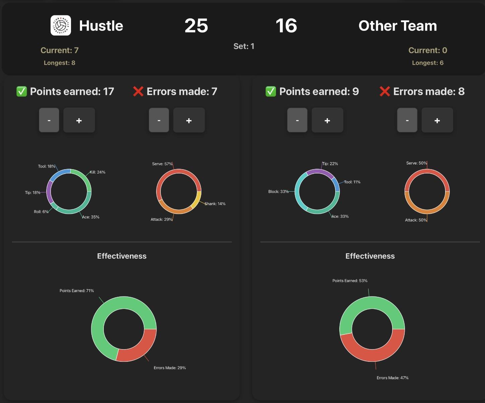
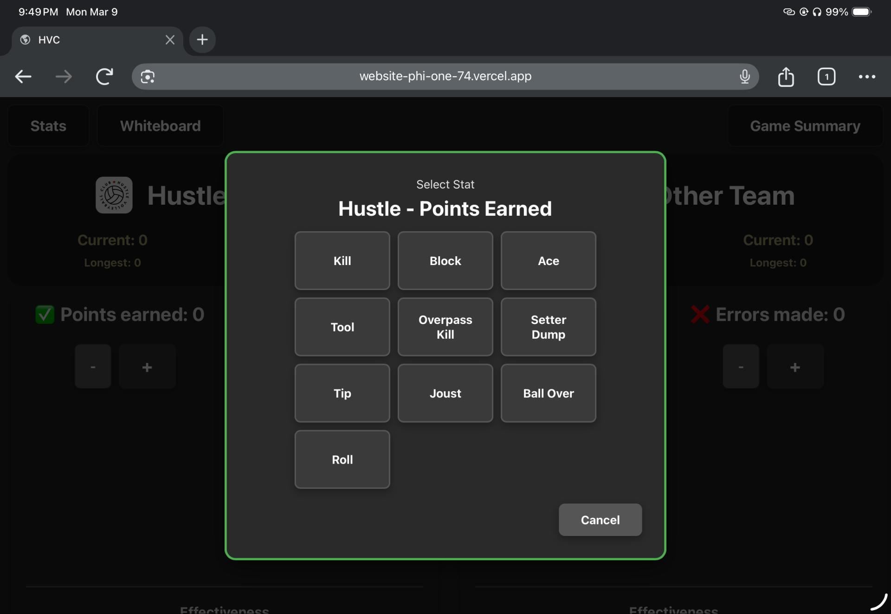
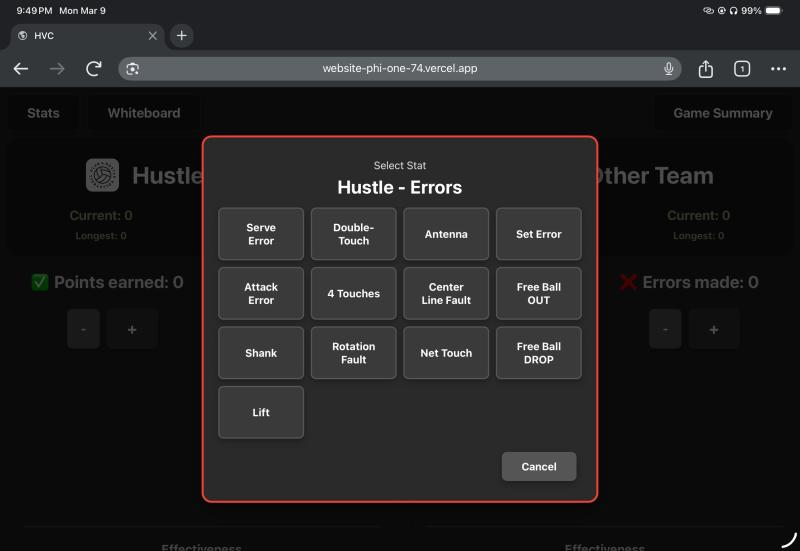
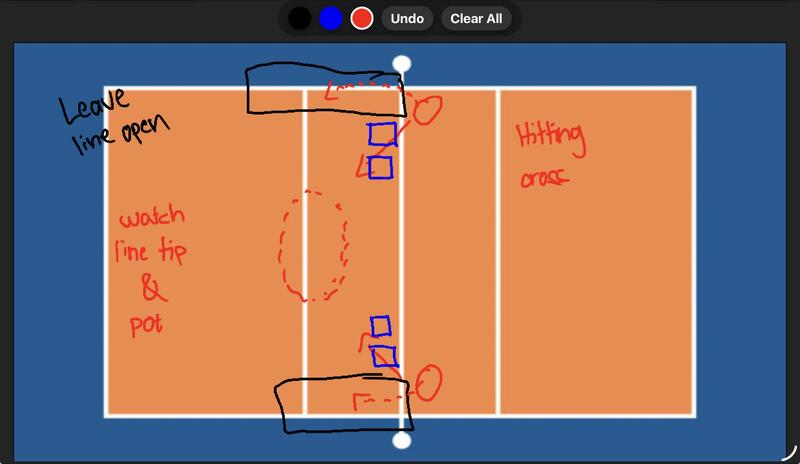
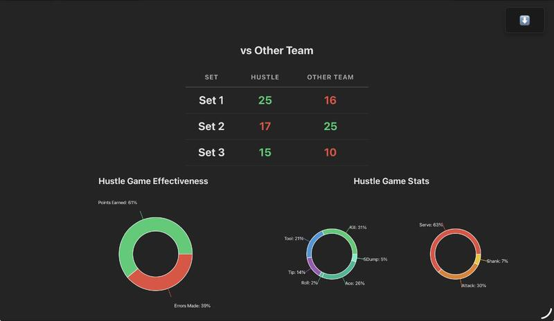

# Volleyball Stat Tracker

A courtside stat-tracking web app for Club Hustle Volleyball. Every point is logged as a **specific action** — not just a tally — so a coach can see *why* the team is winning or losing points while the match is still going on.

**Live app:** https://website-phi-one-74.vercel.app



---

## Why I built it

This started as pen and paper. I was keeping stats for my team by hand, and all I tracked was points earned versus mistakes. That told me the score, but nothing actionable — I couldn't tell whether we were losing on serve errors or getting blocked, or whether our kills were actually landing.

So the app grew one problem at a time:

1. **Track the specific action behind every point** instead of just a running total.
2. Those detailed numbers were hard to read mid-game → **turn them into charts** that show at a glance what's working and where we're breaking down.
3. Wins come from earning more points than you give away → add an **effectiveness** breakdown (points earned vs. errors made).
4. Talking through a play wasn't landing with players → add a **whiteboard** over a court diagram to draw it out.
5. Per-set numbers didn't show the shape of a whole match → add a **game summary** that combines every set into one post-game overview.

---

## Features

### Detailed stat entry

Tapping `+` on either team opens a stat picker instead of blindly incrementing a counter. Ten earned-point actions and thirteen error types are tracked, for **both** teams — so you can see what the opponent is scoring on too.

| Points earned | Errors |
| --- | --- |
| Kill, Block, Ace, Tool, Overpass Kill, Setter Dump, Tip, Joust, Ball Over, Roll | Serve Error, Attack Error, Shank, Lift, Double-Touch, 4 Touches, Rotation Fault, Antenna, Center Line Fault, Net Touch, Set Error, Free Ball OUT, Free Ball DROP |

<p align="center">
  
  
</p>

### Live scoreboard and charts

The scoreboard, per-action donut charts, and effectiveness rings all update as you log points. The app also tracks **current run** and **longest run** for each team, which is usually the number that tells you when to call a timeout.

### Whiteboard

A drawing canvas layered over a court diagram, with three colors, undo, and clear. Touch input is filtered to stylus only, so drawing with an Apple Pencil on an iPad works without a resting palm leaving marks on the court.



### Game summary

After the match, the summary tab combines every saved set: set-by-set scores, overall effectiveness, combined stat breakdowns for both teams, and a one-tap download that exports the whole view as a PNG to share with the team.



---

## Tech stack

| | |
| --- | --- |
| Framework | React 19 |
| Build tool | Vite 7 |
| Charts | Recharts |
| Drawing | HTML5 Canvas API |
| Image export | html2canvas |
| Hosting | Vercel |

---

## How it works

**One source of truth.** The first version stored the score, the earned/error totals, and the detailed stats as separate pieces of state, and they drifted out of sync constantly. Now the detailed stat objects are the only stored values, and everything else is derived from them:

```js
const hustleEarned = Object.values(hustleEarnedStats).reduce((sum, val) => sum + val, 0)
const hustleTotalScore = stats.hustleEarned + stats.otherErrors  // volleyball rally scoring
```

The scoreboard can't disagree with the data behind it, because it *is* the data.

**All logic in one hook.** `src/hooks/useStatTracking.js` owns every stat, the per-team action history, run tracking, and set save/load. `App.jsx` only wires UI to it. Adding set history later was a change to one file.

**Undo without a full undo stack.** Each team keeps an ordered history array of the actions logged. Pressing `-` pops the most recent entry and decrements that specific stat, so corrections during a fast rally don't require finding the right button.

**Set navigation.** Moving between sets snapshots the current set into `savedSets` and either loads the next set's saved data or resets to zero, so you can go back and fix a set you already finished.

**Canvas details.** Touch listeners are registered with `{ passive: false }` so `preventDefault()` can stop the page from scrolling mid-stroke, pointer coordinates are scaled by the ratio of the canvas's internal resolution to its displayed size, and each completed stroke snapshots the canvas as a data URL to power undo.

### Project structure

```
src/
├── App.jsx                     # view routing + UI wiring
├── hooks/
│   └── useStatTracking.js      # all stat state, runs, set save/load
└── components/
    ├── desktop/                # Scoreboard, TeamSection (full layout)
    ├── mobile/                 # Scoreboard, TeamSection (condensed)
    └── shared/
        ├── StatModal.jsx       # action picker
        ├── StatsPieChart.jsx   # per-action breakdown
        ├── EffectivePieChart.jsx
        ├── GameSummary.jsx     # multi-set overview + PNG export
        └── Whiteboard.jsx      # canvas play drawing
```

---

## Running locally

```bash
git clone https://github.com/jrosario0225/volleyball-tracker.git
cd volleyball-tracker
npm install
npm run dev
```

Then open the URL Vite prints (default `http://localhost:5173`).

---

## Known limitations / next up

- **No persistence** — stats live in React state, so a refresh mid-match loses the current game. Saving to `localStorage` is the next thing I'd add.
- **Team-level only** — stats aren't attributed to individual players yet, which is the biggest feature request from coaches.
- **Match history isn't stored** — the game summary covers one match; there's no season view or trends across games.

---

Built for Club Hustle Volleyball.
